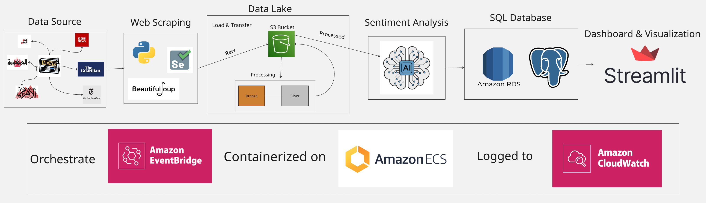
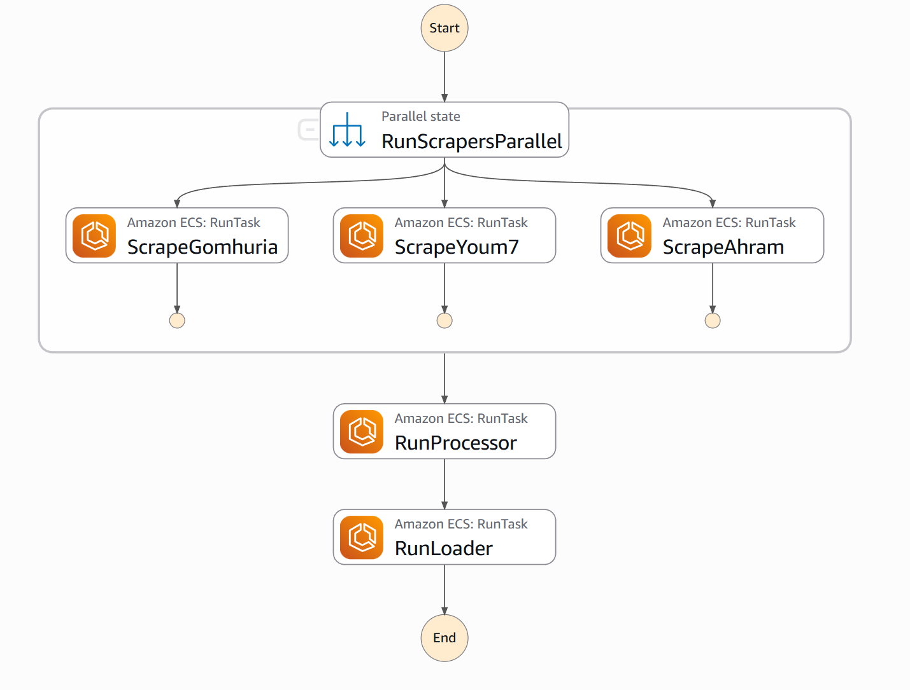
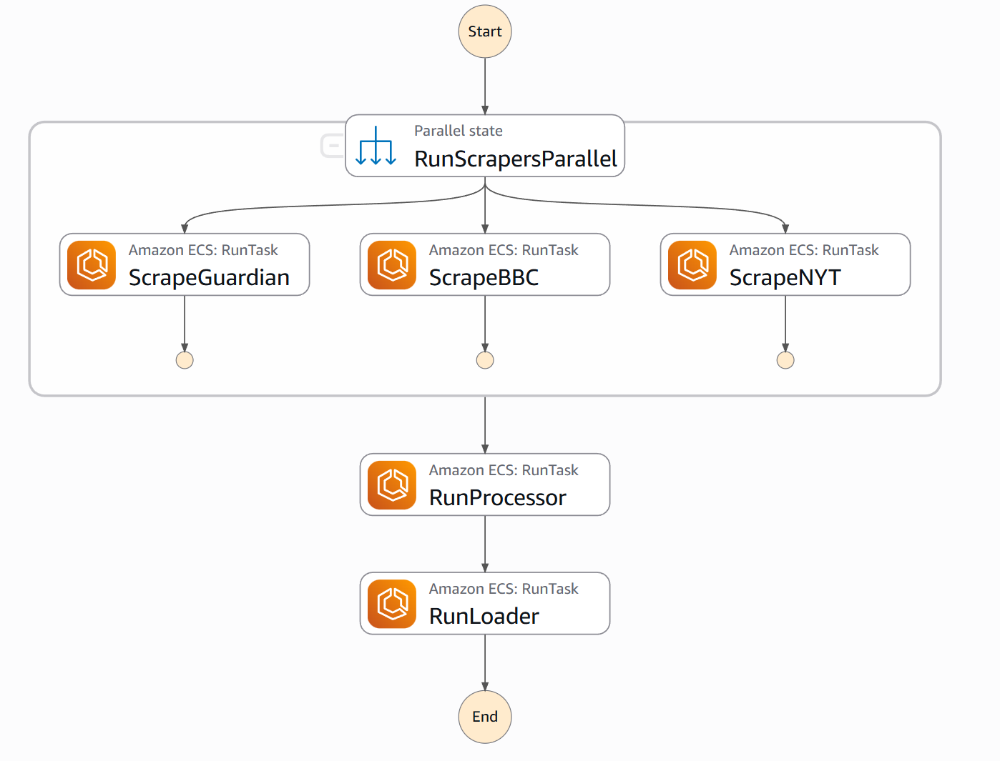
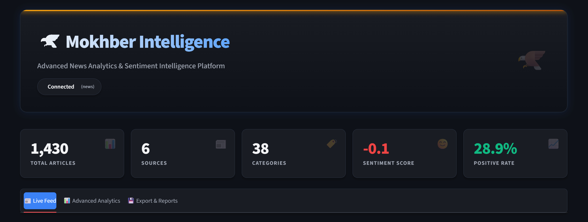
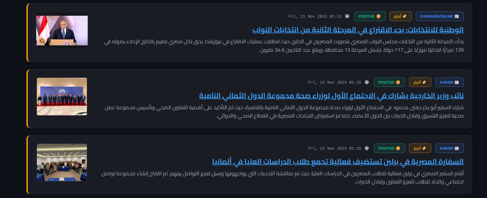
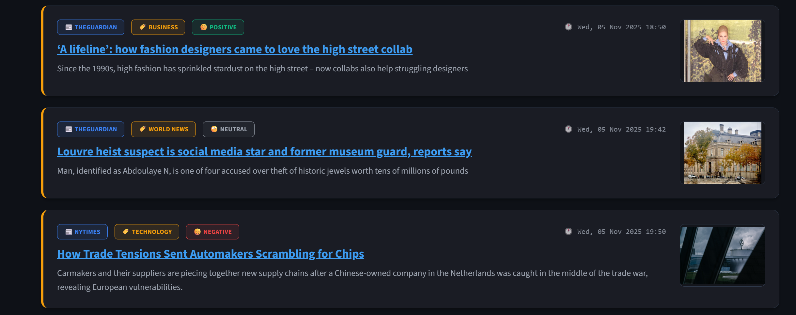
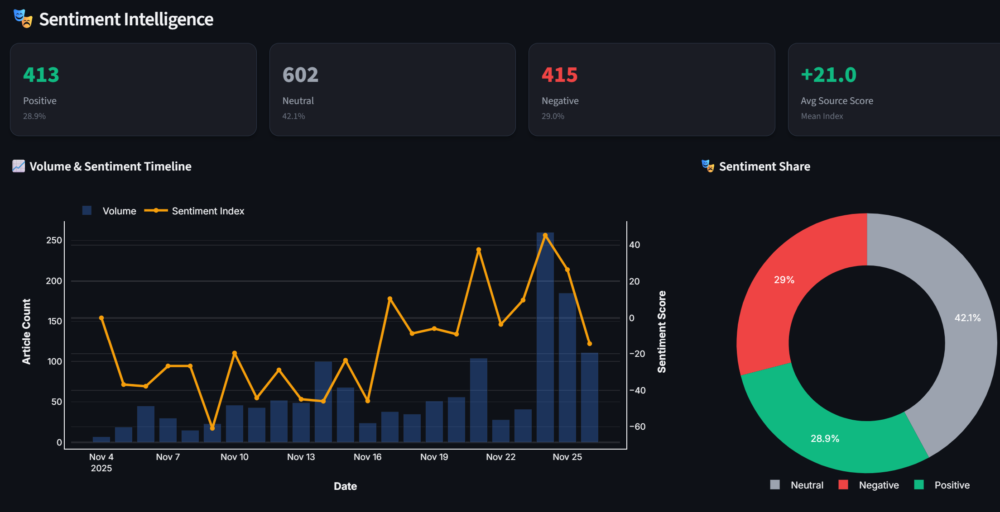
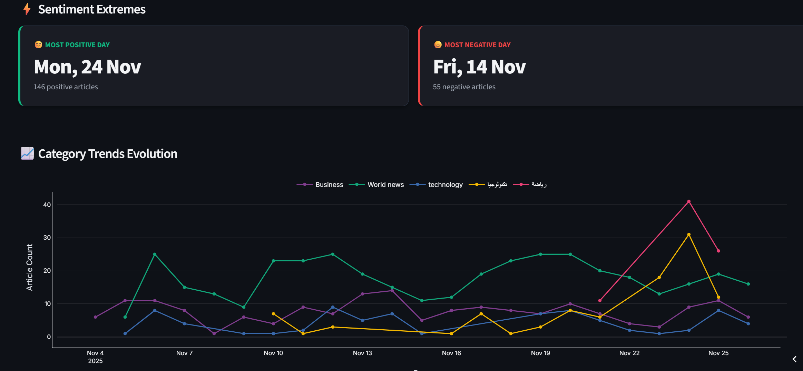

# 🦅 Mokhber Intelligence Platform

<div align="center">


**Advanced News Analytics & Sentiment Intelligence Platform**

*Illuminating the News Landscape with Real-time Arabic & English Analysis*

[](https://aws.amazon.com/)
[](https://www.docker.com/)
[](https://www.python.org/)
[](https://streamlit.io/)

</div>

---

## 📋 Table of Contents

- [Overview](#-overview)
- [Architecture](#%EF%B8%8F-architecture)
- [Features](#-features)
- [Live Demo](#-live-demo)
- [System Components](#-system-components)
- [Technology Stack](#%EF%B8%8F-technology-stack)
- [Getting Started](#for-local-development)
- [Project Structure](#-project-structure)
- [Screenshots](#%EF%B8%8F-screenshots)


---

## 🎯 Overview

**Mokhber Intelligence** is a comprehensive, end-to-end news analytics platform that aggregates, processes, and analyzes news articles from multiple Arabic and English sources. Built with a modern data engineering architecture, it provides real-time sentiment analysis, semantic search capabilities, and interactive visualizations.

### Key Capabilities

- 🔄 **Automated Multi-Source Scraping** - Collects news from 6 major outlets
- 🧠 **AI-Powered Processing** - Gemini & Qwen models for summarization & sentiment
- 🔍 **Semantic Search** - Vector embeddings with pgvector for duplicate detection
- 📊 **Interactive Dashboard** - Real-time analytics with Streamlit
- 🌍 **Bilingual Support** - Full Arabic and English processing pipelines
- ☁️ **Cloud-Native** - Deployed on AWS with S3, RDS, and ECS

---

## 🏗️ Architecture
The platform follows a modern ETL architecture with the following flow:



### Workflow Orchestration
Arabic:


English:


AWS Step Functions orchestrates the entire pipeline:

1. **Parallel Scraping** - Multiple scrapers run simultaneously
2. **Processing** - Language-specific AI enrichment
3. **Loading** - Intelligent deduplication and database insertion

---

## ✨ Features

### 📰 News Aggregation
- **6 Major Sources**: Al-Ahram, Youm7, Al-Gomhuria (Arabic) + Guardian, BBC, NYT (English)
- **Category Coverage**: Politics, Economy, Technology, Sports, Culture
- **Smart Deduplication**: TF-IDF + Vector similarity prevents duplicates

### 🤖 AI Processing
- **Arabic Pipeline**: Google Gemini 2.5 Flash with API rotation
- **English Pipeline**: Local Qwen 2.5 (3B quantized) for cost efficiency
- **Capabilities**: Summarization, Sentiment Analysis, Embedding Generation

### 🔍 Semantic Intelligence
- **Vector Embeddings**: Multilingual MiniLM-L12 (384 dimensions)
- **Duplicate Detection**: 85% similarity threshold with 48-hour window
- **Fast Search**: IVFFlat index on 100 lists

### 📊 Analytics Dashboard

**Live Feed Tab**

- Real-time article cards with images
- RTL support for Arabic content
- Advanced filtering (source, category, sentiment, language)
- Search with highlighting


**Advanced Analytics Tab**
- Sentiment timeline & distribution
- Hourly/daily trends
- Category evolution charts
- Content intelligence (N-grams)
- Temporal analysis (weekday patterns)

**Sentiment Intelligence**
- Positive/Neutral/Negative breakdown
- Average source scores
- Sentiment extremes detection


### 🎨 Theming
- **Midnight Mode** (Dark) - Default high-contrast theme
- **Daylight Mode** (Light) - Professional light theme with hybrid dark sidebar
- Dynamic theme switching without page reload

---


---

## 🌐 Live Demo

**Experience Mokhber Intelligence in action!**

🔗 **[Try the Live Dashboard](https://mokhber.streamlit.app/)**

Explore real-time news analytics, sentiment trends, and interactive visualizations without any setup. The dashboard is updated regularly with the latest articles from our 6+ news sources.

---

## 🧩 System Components

| Component | Technology | Purpose |
|-----------|------------|---------|
| **Scrapers** | Python, Selenium, BeautifulSoup | Multi-source news collection |
| **Data Lake** | AWS S3 | Raw article storage |
| **Processors** | Gemini API, Qwen GGUF | AI enrichment pipelines |
| **Database** | PostgreSQL + pgvector | Structured storage with vector search |
| **Orchestration** | AWS Step Functions, EventBridge | Workflow automation |
| **Dashboard** | Streamlit, Plotly | Interactive visualization |
| **Deployment** | Docker, AWS ECS Fargate | Containerized cloud hosting |

---

## 🛠️ Technology Stack

### Backend & Processing
- **Python 3.11** - Core language
- **Selenium** - Dynamic content scraping
- **BeautifulSoup4** - HTML parsing
- **Google Gemini API** - Arabic NLP
- **Llama.cpp** - Local inference (Qwen)
- **Sentence Transformers** - Embedding generation
- **scikit-learn** - TF-IDF deduplication

### Database
- **PostgreSQL 16** - Primary database
- **pgvector** - Vector similarity search
- **SQLAlchemy** - ORM & connection pooling

### Frontend
- **Streamlit** - Web framework
- **Plotly** - Interactive charts
- **Pandas** - Data manipulation

### Infrastructure
- **AWS S3** - Data lake
- **AWS RDS** - Managed PostgreSQL
- **AWS ECS Fargate** - Serverless containers
- **AWS Step Functions** - Orchestration
- **AWS EventBridge** - Scheduling
- **Docker** - Containerization

---

## 🚀For local Development

### Prerequisites

- Python 3.11+
- Docker & Docker Compose
- AWS Account (for cloud deployment)
- API Keys: Gemini API

### Local Development Setup

1. **Clone the Repository**
   ```bash
   git clone https://github.com/yourusername/mokhber-intelligence.git
   cd mokhber-intelligence
   ```

2. **Set Environment Variables**
   ```bash
   # Copy example env file
   cp .env.example .env
   
   # Edit .env with your credentials
   nano .env
   ```

   Required variables:
   ```env
   # Database
   RDS_HOST=your-postgres-host
   RDS_PORT=5432
   RDS_DB=news_db
   RDS_USER=your-user
   RDS_PASSWORD=your-password
   
   # AWS
   AWS_BUCKET_NAME=your-s3-bucket
   AWS_REGION=us-east-1
   
   # APIs
   GEMINI_API_KEY=your-gemini-key
   GEMINI_API_KEY_1=additional-key-1
   GEMINI_API_KEY_2=additional-key-2
   
   NYT_API_KEY=your-nyt-key
   GUARDIAN_API_KEY=your-guardian-key
   ```

3. **Run with Docker Compose**
   ```bash
   # Build images
   docker-compose build
   
   # Run specific components
   docker-compose up scrapers
   docker-compose up processors
   docker-compose up loader
   docker-compose up dashboard
   ```

4. **Access Dashboard**
   ```
   http://localhost:8501
   ```

### Cloud Deployment & More Details
Detailed deployment instructions are in each component's README:
- [Scrapers Deployment](Scrapers/readme.md)
- [Processors Deployment](processor/readme.md)
- [Dashboard Deployment](Streamlit/readme.md)

---

## 📁 Project Structure

```
Project_News_Sentiment_Analysis/
│
├── 📂 Scrapers/                    # News collection modules
│   ├── ahram/                      # Al-Ahram scraper
│   ├── youm7/                      # Youm7 scraper
│   ├── gomhuria/                   # Al-Gomhuria scraper
│   ├── guardian/                   # The Guardian scraper
│   ├── BBC/                        # BBC News scraper
│   ├── nyt/                        # New York Times scraper
│   └── readme.md
│
├── 📂 processor/                   # AI enrichment pipelines
│   ├── arabic_processor/           # Gemini-based Arabic NLP
│   ├── english_processor/          # Qwen-based English NLP
│   └── readme.md
│
├── 📂 loader/                      # Database ETL
│   ├── etl_loader.py              # RDS ingestion with deduplication
│   ├── Dockerfile
│   └── readme.md
│
├── 📂 Streamlit/                   # Dashboard application
│   ├── app.py                     # Main entry point
│   ├── config/                    # Configuration management
│   ├── database/                  # DB connection & queries
│   ├── ui/                        # UI components & charts
│   ├── utils/                     # Helper functions
│   ├── views/                     # Page modules
│   └── readme.md
│
├── 📂 media/                       # Screenshots & diagrams
│   ├── mokher_logo.png
│   ├── system_architecture_diagram.png
│   ├── step_functions_workflow.png
│   ├── dashboard_overview.png
│   └── ...
│
├            
├                   
└── README.md  # This file
```

### Component Details

Each major folder contains:
- **Dockerfile** - Container definition
- **requirements.txt** - Python dependencies
- **README.md** - Component-specific documentation

See individual READMEs for detailed information:
- [📰 Scrapers Documentation](Scrapers/README.md)
- [🤖 Processors Documentation](processor/README.md)
- [📊 Dashboard Documentation](Streamlit/README.md)


---

## 🖼️ Screenshots

### Main Dashboard


### Live Feed with Filtering





### Sentiment Analysis


### Advanced Analytics



## 🙏 Acknowledgments

- **News Sources**: Al-Ahram, Youm7, Al-Gomhuria, The Guardian, BBC, New York Times
- **AI Models**: Google Gemini, Qwen 2.5, Sentence Transformers
- **Cloud Provider**: Amazon Web Services
- **Open Source Community**: Streamlit, Plotly, pgvector

---

<div align="center">
*Illuminating the News Landscape • Mokhber Intelligence Platform*
</div>
